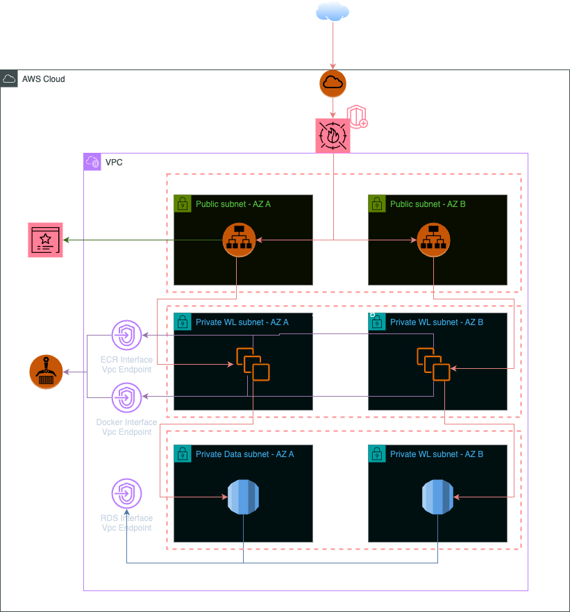

# RFC: L5 TechLead. Home Assignment

## Background
Clients rely on our public services as the gateway to our offerings. Their seamless access requires uninterrupted availability, a constant assurance that every aspect of our services is accessible around the clock. Our goal is clear: to maintain continuous service, serving as the backbone of our digital presence. This steadfast commitment to availability forms the foundation of our digital domain.

## Current solution
In our existing setup, we currently deploy our public web server across three EC2 instances. This configuration not only provides us with a robust and highly available infrastructure but also leverages an RDS SQL Server to enhance the efficiency and reliability of our database services. However, it's important to note that we encounter challenges during periods of high connection peaks due to the absence of an auto scalable solution. This limitation impacts our ability to seamlessly handle increased traffic demands.

## Current architecture

- Terraform playbook executed from local laptop
- public load balancer assigned sec group A - azs a,b,c
- k8s with sg b
- rds authenticated via user-pwd which is configured in config file of the website
- container images hosted in ecr with all config
- dev team convinced of scalability of of containers during peaks

It is understood that the current architecture is leveraging EKS and the shown instances on the diagram are instances belonging to nodegroups of that cluster.
 
## Problems [of the current solution]

The requested analysis is that of threat modelling of the provided architecture and hence the analysis for problems focuses only on security issues within the architecture and will not enter into system architecture or operational problems.

Although more extensive analysis and problems could be conducted, considering the time scope of this assignments we will focus on the biggest and more notourious observed problems.

### Change Management Process

The provided context for the solution indicates that change management for the solution is conducted from a  working     laptop. The fact that is possible indicates likely lax change management processes when it comes to the operation of infrastructure. 

Exceptuating certain allowed development environments like sandboxes where change management can be more lax in favour of the required flexibility to experiment, and specially for production grade environments change needs to be properly controlled. 

Identities able to change the infrastructure should be limited and heavily restricted and not directly accessible by developers to protect the infrastructure in the following ways:
- Reducing the amount of identities with the ability to mutate the infrastructure helps on reducing the identity surface to protect.
- Local modifications of infrastructure bypass any CICD/SDLC restrictions and health checks without which we loose a big ability to validate the security health of the changes (both via automatations and code reviews) and prevent new security risks from being introduced into the infrastructure.

### Secret Management

The following architecture uses an unsecure access control strategy for the RDS database and has a poor secret handle strategy likely leaking secrets in artifacts and code. This makes the architecture way more vulnerable to secret leaking without the protections that IdP integrated identities provide and the consequential likely access breach and data leak.

In this case, credentials would be presented and potentially leaked through the code that builds the containers and the images present in the ECR registry since the images are mentioned to contain all the necessary configuration files and the files to contain the credentials for the database.

Also, because the served application which would hold the credentials and connects directly to the database is the the actual client web application rather than a backend service, although the application structure is not completely clear, we are introducing security risks by having exposed applications with direct access to critical access and specially by using and hardcoding credentials in the file system to acces such systems. A morr sophisticated application architecture desgin with more isolation between the client layer and the data assets would reduce the securtiy risks and require further lateral movement and more security measures to be bypassed so to be able to reach the data assets.

Authentication for such critical data assets like databases should be heavily controlled and restricted. RDS integration with IAM should be leveraged to provide fine grained access to the database data plane by leveraging both machine and human identities rather than being based on credentials.

This approach allows us to:
- Integrate critical data assets into our strong and integrated identity and access control system where we have all sorts of protections and visibility to protect the system against a great variety of threats.
- Provide fine grained access based on the different usage patterns and easily assign that to already existing identities.
- Avoid the need to provide any sort of credential and embed in code, even if it is in an encrypted form and use machine identities instead for authentication which can be configured and assigned without using any sort of credential.

### Network security

The other aspect we can analyze as per the provided context is network security. The ingress strategy for the application is as per standard approach since we are providing a single point of ingress through a managed resource that given the proper configuration allows to heavily control the ingress surface into our workloads.

When it comes to the network design we have three very distinct layers where we want to provide the bigger isolation we can. 
1. An ingress layer where we want to both limit the networks and ports this layer should be able to reach based on the address range and ports where the workloads expect connections.
2. A workload layer that should only accept connections for the exposed ranges and ports that should be contacted to interact with the provided services meant to be exposed outside this layer.
3. A data layer where data resides and connectivity towards which should be limited to the ports to satisfy the connection requirements of the connecting layer.

The current architecture does not match this logical design and specially there is a big problem in the public subnet as we are mixing up the load balancer and the instances for the cluster.

The following observations are made for the provided security groups:
1. Ingress Layer Security Group . SG A -> Ingress Security Group exposes only the relevant port thorugh which the service should be contacted from the outside and allows it for any source ip as it is protecting an asset which will have to be reachable from public networks. 

Nonetheless, the lack of a subnet separation between the ingress layer and the workload layer does not allow to limit that wide access to the load balancer - which should be the only assets directly exposed to the outside world. Load balancers should have their own subnet separated from that of the assets in the workload layer.

2. The workload layer security group exposes access to both http and https port. We should look at keeping the internal communication within tls protection to also protect against internal threats.

3. The security group for the data layer does not need to expose port 80. Only reachability from workloads towards RDS is necessary.

Also, there is a lack of security protections in the communcation chain, no WAF, no DDOS Protection, no references to internal detection systems like IDS/IPS and other security means meant to help protect the data and workloads from a network perspective.

In general:
- It is not obvious if there is encryption of communications once TLS is terminated in the load balancer.
- There is lack of network segmentation
- Security groups are overpermissive.
- Lack of security services in the network design like WAF, DDOS Protection, IDS/IPS and others...

Also, besides all of the above, the network ranges used as well as the subnets created are not compatible with the multi-AZ solution as well as the cidrs. so the subnetting should be slightly changed to allow this implementation.

Also, connectivity towards AWS services is performed directly and hence going through public networks. That should also be restricted within private networks.

## Competing solutions 

When it comes to outlaying competing solutions we will focus on secret management and network security areas of the solution as when talking about change management we would enter more into tooling decisions than any architectural decisions.

### Secret Management

When focusing on secret management, particularly for the RDS database credentials. We have two goals: 

- Securing the used credentials to avoid credential exposure and leaks
- Having fine grained control over the database operations
- Integrate towards the Org Wide SSO System

With RDS we have three ways of configuring authentication:

- Kerberos - which is considered a not fully secure and legacy protocol and since there is no mention of an existing implementation we will discard this option.
- Local Credentials configured at DB level - which can achieve fine grained control over the database operations in a familiar manner for DB Engineers.
- IAM - which would integrate the authentication and authorization for the data plane into the SSO system and integrated identity setup. This would allow us to not generate credentials at all and leverage all the features provided by IAM and the IdP for identity security.

When working with IAM we can provide the identity in the infrastructure/orchestrator level which is more secure whilst with local credentials we would have to include those at configuration level although we would also be able to add additional layers of protection by securing them using means like SSM Parameter Store or Secret Manager.

### Network Security 

Around network security we see a need for a considerable set of changes to be proposed. Both for the need to properly structure networking so to make it work as well as to properly isolate the different components into different architectural layers between which we can properly control the data flows and introduce proper restrictions.

We can mainly attack the outlaid issues with two approaches:
- keeping the current network design and just adding security measures in top.
- Changing slightly the layering of the network architecture to segreate responsibilities into layers and ease the design of proper security mechanisms.

## Selected solution

To explain the selected solution we will go over the same areas we have identified issues for.

### Secret Management

For secret management we are introducing the following changes into the architecture:

- The RDS authentication is changed to be integrated with IAM
- Multiple roles based on least privilege basis are created for the different use cases of interactions agains the database and assigned to the IAM identities that require it.
- Since IAM is associated with our IdP we leverage the security measures from our Integrated Identity system to secure human identities. Machine identities are restricted by the measures introduced by IAM.
- Because we no longer use credentials there is no longer risk of exposure, the workloads will associate themselves to the necessary identity to perform their interaction with the database through `pod identities` which will be directly associated to the pods running the web application. There is no longer a credential leak risk to mitigate.

### Change Management

Proper change management processes need to be implemented into the SDLC to ensure that all changes to the infrastructure are reviewed before being merged and applied to prevent unwanted changes to happen. The necessary automated checks shoul prevent faulty or unsecure configuration and changes to be applied.

The IAM policies associated with human users should, except in very specific cases, lack the permissions to directly apply the changes to infrastructure and only the identities for the cicd workflows be able to apply such changes. 

Monitoring should be put in place to detect alterations of the infrastructure made by identities that should not be able to perform such changes.

### IAM

IAM should be leveraged to restrict the operations that each component of the architecture can perform. In the case of the presented architecture. We can leverage IAM to restrict who can reach and perform data operations agains the ECR registry containing the container images, limit the interaction with the databases and provide it only to the necessary identities via its human identity or the machine identity associated to the workloads via `pod identity`.

VPC endpoints should also be analyzed for required usage within the VPC and endpoint policies be configured to limit the operations that can be performed through them to those necessary to provide the desired functionality.

### Network Security

This is by far the more extensive area of change in the presented architecture.

- We chane the subnet into three layers to separate the different layers of the application at network level.
    - We define a data layer with its own set of subnets to host the RDS database.
    - We define a workload layer where the cluster instances will live.
    - We define an ingress layer where the public resources will reside.
- For each layer we create two subnets rather than one as we need to support two different AZs.
- In the public subnets we create for each a NAT Gateway to provide outbound connectivity to the EKS Cluster
- The load balancer is created in a  multi-az setup and associated with the two public subnets.
- In top of the application gateway we add network security services to protect the ingress traffic against different types of attacks. 
    - We do that mainly be the addition of a WAF which will also gives a degree of custom control over what we allow to reach our application as well as to provide protection against common and known threat scenarios. 
    - We also introduce AWS Shield to provide advanced protection against DDOS attacks.
- For the different managed services we are using, instead of directly communicating to their APIs and hence connecting via the public internet, we create vpc endpoints of Interface type to provide private connectivity to the APIs and reduce the exposed network communcations of our architecture. This is specially relevant for ECR as through this method we can make it accessible only to the relevant security group.
- The configuration of the security groups is changed to remove unnecessary provisioned connectivity.
    - The Security group A is kept as is but thanks to the separation of the subnets and its association only to the load balancers no longer provides access to the cluster reosurces too.
    - The Security Group B is providing unnecessary connectivity, one of the ports can be ommited depending on the configuration of the workload. Ideally we would support MTls through all the communication chain and hence we could remove port 80 rule from this security group.
    - The security group C is reconfigured to only provide access to the database port 3306.
    - Security Group B is reconfigured to provide the access only to Security Group A
    - Security Group C is reconfigured to provide the access only to Security Group B. This makes it very clear that only the prior layer can reach the next inbound.

### Notes

If we enter into the orchestrator layer there is a great number of additional measures we can add to increase the security of the workloads and data by leveraging policies, network restrictions, app level authentication and an endless list of other security measures that can be defined within the cluster to heavily control what is possible within it.

## New architecture Diagram

## Reliability and Security

## Scalability

The architecture leverages managed services and has geo redundancy, the architecture can easily scale across both network and compute capacity requirements as the demand increases.

Additional and specific configuration can be implemented to even further increase the scalability of the solution but that is not the focus of this RFC.

## Dependency considerations
 
As part of this RFC we have no knowledge of the application requirements so we cannot analyze the dependency considerations for it to work. 

All the network components of the presented architecture can be re-arranged with instance, az and region redundancy to provide the required level of High Availability as per the bussiness requirements.